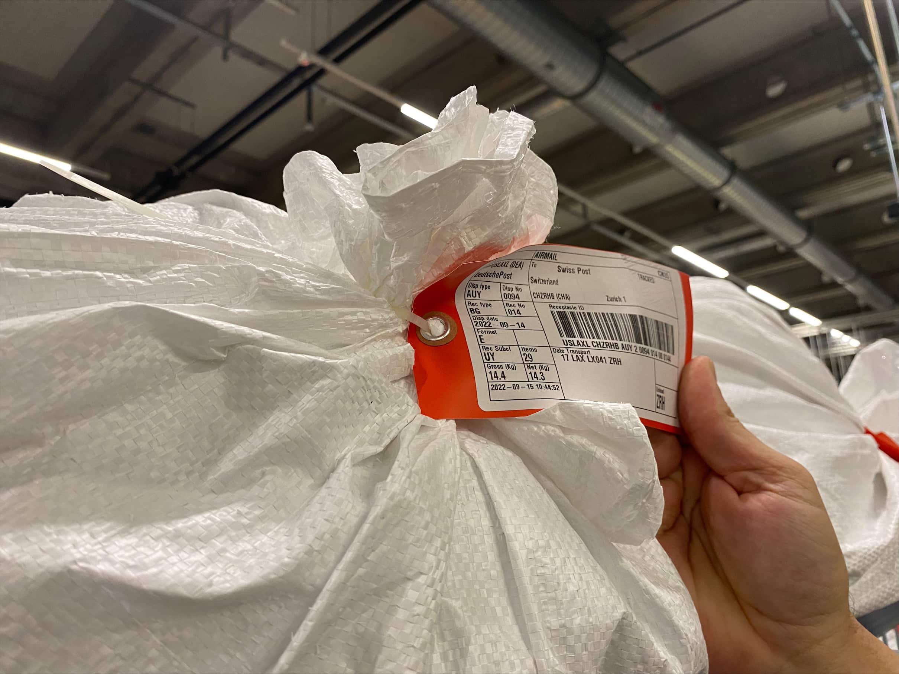

+++
title = "Die Reise eines Pakets"
date = "2022-11-30"
draft = false
pinned = true
image = "image-min-min.jpeg"
description = "Reportage über die internationale Paketverarbeitung im Briefzentrum Zürich-Mülligen."
+++
 Menschenschädel oder Picassos Kunstwerke: alles Mögliche ist Teil des internationalen Postverkehrs. Wir bekommen einen Einblick in die Paketverarbeitung und packen an. 

Es ist ein Montagmorgen und wir – zwei Schüler des Gymnasiums Kirchenfeld – treffen in Zürich ein. Wir steigen ins Tram. Unsere heutige Destination ist das Briefzentrum in Zürich-Mülligen. Nach der Ankunft stehen wir vor dem mächtigen Gebäude. Wir sind verabredet mit Rocco Lionetto, dem Teamleiter des Zolldeklarantenteams für die internationale Post. Er ermöglicht uns heute einen Einblick in die internationale Paketsortierung. Wir werden herzlich von ihm empfangen und erhalten Badges, die uns den Eintritt in das Briefzentrum erlauben. Durch Drehtüren gelangen wir in eine der modernsten Schweizer Anlagen für die internationale Briefverarbeitung. Unsere Führung durch das gewaltige Gebäude beginnt.

")



Die Schweizer Bundespost wurde am 1. Januar 1849 vom Bund gegründet, um das Volk mit Geld-, Post- und Personenverkehr zu versorgen. Vorab waren diese Aufgaben unter Verantwortung der Kantone. Die Monopolisierung garantierte die Grundversorgung, vergünstigte und beschleunigte den Posttransport. Im Jahr 1906 wurde die erste Buslinie zwischen Bern und Detligen eröffnet - das Postauto wurde geboren. In den darauffolgenden Zwanzigern wird die Post mit dem Telefon- und Telegrafendienst zur PTT zusammenführt. Der Paketmarkt für Briefe über 100 Gramm wurde im Jahr 2006 entmonopolisiert. Drei Jahre später wurden die drei grossen Briefzentren aufgestellt: Härkingen, Zürich-Mülligen und Éclepens. Mit diesen Anlagen wurde die Brief- und Paketverarbeitung neu erfunden. 



## Die Aufgaben der Post

Wir treten mit Rocco Lionetto in eine Halle ein. Mitarbeiter sind mit kleinen, teilweise plastikumhüllten Kartonschachteln beschäftigt. Grelle Lichter scheinen von der Decke herab, während Paketlieferbänder im Hintergrund surren. Gelegentlich hört man ein Piepsen. Rocco – wir dürfen ihm Du sagen – erklärt uns, wofür die Post eigentlich verantwortlich ist. Die Post hat unter anderem die Aufgabe, der Schweizer Bevölkerung Dienstleistungen zu garantieren. Sie übernimmt die Versorgung im Bereich der Logistik: Sendungen werden entgegengenommen, in einer zentralen Anlage sortiert und den jeweiligen Empfängern zugestellt. Dabei spielen Ursprung oder Grösse des Pakets keine Rolle. Von Ali-Express-Paketen aus China bis hin zu Gartenhäusern aus lokalen Baumärkten - alles wird in Zürich-Mülligen verarbeitet. Ausserdem hat die Post die Verpflichtung, Zugangspunkte in erreichbarer Distanz für alle Einwohner:innen der Schweiz zu unterhalten. 90 Prozent der Bevölkerung muss innerhalb von 20 Minuten mit dem öffentlichen Verkehr eine Poststelle erreichen können. Wenn das nicht der Fall ist, muss innerhalb von 30 Minuten eine Stelle mit einem Hausservice verfügbar sein. Darüber hinaus muss pro 15'000 Personen in urbanen Ortschaften mindestens eine Poststelle bestehen. Wenn diese Vorschriften nicht erfüllt werden, muss eine weitere Stelle eröffnet werden. Es steckt also viel mehr Planung hinter der Verteilung von Poststellen, als man denkt. Wir lassen uns von Rocco durch die Abteilung der internationalen Post führen und verschaffen uns einen ersten Eindruck von der Anlage.

")

Die Post regelt nicht nur die Logistik, sondern hat auch ihre eigene Bank, die Postfinance. Diese gibt der Schweizer Bevölkerung die Möglichkeit, ein Bankkonto zu eröffnen und anschliessend zu führen. Im Service der Postfinance ist auch die Bareinzahlung und der Bargeldbezug innerhalb der Schweiz inbegriffen. Zu beachten ist, dass die Preise dieser Dienstleistungen unter der gesetzlichen Vorgabe des Schweizer Bunds stehen. Das hat beispielsweise zur Folge, dass die Lieferpreise unabhängig von der Distanz etabliert werden.

## Gebührenpflichtig oder nicht?

Wenn man eine Sendung aus dem Ausland in die Schweiz liefern lässt, ist sie grundsätzlich zoll- und mehrwertsteuerpflichtig. Die vom Warenwert abhängige Mehrwertsteuer muss jedoch erst bezahlt werden, wenn sie über 5 Franken beträgt. Beim Normalsatz von 7.7 Prozent ist die mehrwertsteuerpflichtige Einfuhr ab 65 Franken.

Nahrungsmittel, Medikamente, Zeitungen und Bücher haben einen reduzierten Mehrwertsteuersatz von 2.2 Prozent. Die mehrwertsteuerfreie Einfuhr liegt deshalb bei 227.25 Franken. Je nach Ware können unerwartete Gebühren anfallen, welche der Paketempfänger bezahlen muss. Das Deklarieren dieser Zollgebühren übernehmen die Mitarbeiter von Roccos Team im Paketzentrum Zürich-Mülligen, das Rocco uns später mit viel Begeisterung demonstriert.

## Die Anreise eines Pakets

Rocco will uns zeigen, wie internationale Pakete im Briefzentrum ankommen. Wir steigen mit ihm Treppen hinunter in die erste Etage und werden zuerst zu den frisch eingetroffenen Ladungen von Briefen und Päckchen geführt. Wir bleiben vor grossen Säcken und Sammelbehältern stehen, die viele kleine Pakete enthalten, die erst kürzlich per Lastwagen vom Flughafen zugeliefert wurden. Rocco erklärt uns, dass Lieferungen direkt von der Grenze ins Briefzentrum gefahren werden, damit auf dem Weg nichts verloren geht. Die Lastwagenfahrer erhalten ein Einführdokument für die Einreise in die Schweiz. In diesem Dokument sind Ursprungsländer und die Destinationen der Güter des Transports festgehalten. Die Fahrer sind deshalb gezwungen, ihre Ladung ohne Zwischenstopp in das Briefzentrum zu liefern. Bei der Ankunft löschen Postmitarbeiter im Briefzentrum diesen Lieferschein aus dem System, womit die Ankunft der Ladung im Netzwerk bestätigt wird.

Die Säcke, welche internationale Pakete enthalten, sind immer mit einem Zettel markiert. Auf diesen Zetteln, welche auch «Tags» genannt werden, steht das Ursprungsland, das Gewicht und der Inhalt des entsprechenden Sacks. Rocco zählt uns auf, woher die Säcke kommen, indem er uns die Kürzel auf einigen Zetteln vorliest. Uns war vorher nicht bewusst, dass derartig grosse Mengen an Paketen aus aller Welt in das Postzentrum gelangen. Rocco erklärt uns, dass diese «Tags» von Mitarbeitern eingescannt werden müssten, da diese Zettel für die Anmeldung im Sortiersystem essenziell seien. Nach dem Öffnen der Säcke werden die Kleinpakete per Förderband in die nächste Etage befördert, wo sie weiterverarbeitet werden.

## Die Kontrolle der Pakete

Wir begeben uns nun mit Rocco in die Etage, wo das Zolldeklarantenteam arbeitet. Rocco ist der Teamleiter in diesem Geschoss, deshalb stellt er uns seine Mitarbeiter:innen vor. Ihre Aufgabe ist es, internationale Pakete abzutasten und ihren Inhalt abzuschätzen, da durch ihn die Abgabepflichtigkeit der Pakete bestimmt wird. Nach diesem Kriterium werden die Pakete ein erstes Mal unterteilt und mit verschiedenfarbigen Klebern markiert. Die Herausforderung dabei ist, dass die Mitarbeiter:innen die Pakete nicht aufmachen dürfen. Sie müssen mit Fingerspitzengefühl und Erfahrung urteilen.

> «Sendungen aus China werden zu 90 Prozent falsch deklariert.»
>
> *Rocco Lionetto*

Ein grüner Aufkleber wird auf ein Paket geklebt, wenn die Ware im Paket leichter als 65 Kilogramm ist oder einen Wert unter 227.25 Franken hat. Grün markierte Pakete sind nicht gebührenpflichtig und werden in den nationalen Bereich weitergeleitet, wo sie dem Empfänger zugestellt werden. Ein blauer Aufkleber wird verwendet, wenn Zweifel über den Inhalt, den Preis oder das Gewicht bestehen. In diesem Fall muss die Ware geöffnet und genauer untersucht werden. Bei Unsicherheit des Warenwerts wird der Empfänger kontaktiert. Falls sich in dem Paket illegale Ware befindet, wird es dem Zoll übergeben. Wenn ein Paket abgabepflichtig ist, wird dieses rot markiert. Die Deklaranten definieren in diesem Fall die Zoll- und Steuerabgaben. Wir beobachten, dass die meisten Pakete, die mit chinesischer Schrift gekennzeichnet sind, einen roten Kleber draufhaben. «Sendungen aus China werden zu 90 Prozent falsch deklariert», sagt Rocco.

")

Wir bekommen eine Chance, unser Fingerspitzengefühl zu testen. Einer der Mitarbeiter gibt uns jeweils ein Paket in die Hand. Wir können den Inhalt schlecht einschätzen. Rocco, der viel Erfahrung hat, zeigt da weniger Mühe. Er errät innerhalb weniger Sekunden, dass es sich um ein Buch handelt.

Ein Zöllner steht zur Kontrolle der Postmitarbeiter ganz am Ende des Förderbands, auf dem sich die Pakete entlang bewegen. Dieser Zöllner dient als letzter Kontrolleur, bevor die Pakete im nationalen Postverkehr weiterverarbeitet werden. Mitarbeiter:innen können sogar bestraft werden, wenn sie falsch gekennzeichnete oder verbotene Ware nicht erkennen und diese von einem Zöllner rausgenommen werden. 

Rocco zeigt uns am Computer, wie die Abgaben der rot gekennzeichneten Pakete festgelegt werden. In einem Register sind Prozentsätze für jede Art von Ware registriert. Bevor dieses Register erstellt wurde, mussten die Postmitarbeiter ein manuelles Tarifbuch, welches auch scherzhaft «die Bibel» genannt wird, zur Hand nehmen. Mit dem Tarifbuch mussten die Mitarbeiter aus fast 100 Kapiteln die richtige Untergruppe eines Produkts finden und schliesslich den entsprechenden Prozentsatz anwenden.

## Illegale Paketinhalte

Wir laufen während unserer Tour am Zollamt vorbei. Dies ist ein kleines Büro in der Mitte der Halle des Briefzentrums. Unser Interesse an illegaler Ware wird damit erweckt. Deshalb fragen wir Rocco, ob wir mit ihm in das Zollbüro hineintreten dürfen. Ein Zollbeamter sagt uns als Beispiel, dass Drogen verbotene Waren seien und mit einer Verhaftung des Empfängers bestraft würden. Ein Empfänger von gefälschter Ware, beispielsweise einer gefälschten Markentasche, kann auch eine Strafe erhalten. Bezahlt die von der Fälschung betroffene Firma den Zoll, so wird die Ware als Fälschung markiert und folgend vernichtet. So stellt sich uns die Frage, wie Versender oder Hersteller der verbotenen Ware zur Strecke gebracht werden.

«Das ist beinahe unmöglich», sagt Rocco, «und in keinem Szenario rentabel.» Der Absender ist beinahe in allen Fällen im Ausland stationiert, das heisst, man müsste sich dafür mit den Staatsgewalten anderer Länder auseinandersetzen. Kriminelle Aktivitäten können also schwer von der Schweiz aus in anderen Ländern geregelt werden. Die einzigen Massnahmen in der Schweiz betreffen somit den Empfänger des Pakets. 

> «Nach 30 Jahren findet man keine Paketinhalte mehr merkwürdig.»
>
> *Rocco Lionetto*

Es könne auch der Fall sein, dass der Empfänger mit den Paketinhalten nichts zu tun habe, sagt Rocco. Es kann beispielsweise vorkommen, dass ein Paket als Sabotagemittel zugestellt wird. Da könne jeder zum Opfer einer solchen Aktion werden und somit unschuldig bestraft werden. Falls Zweifel über den Inhalt oder über den Absender bestehen, wird empfohlen, das Fremdpaket nicht anzunehmen. Denn ohne eine Unterschrift des Empfängers kann die Polizei nicht einschreiten. Wir fragen daher Rocco nach obskuren Gegenständen, die in Paketen aufgefunden werden. Er meint: «Nach 30 Jahren findet man keine Paketinhalte mehr merkwürdig.» Alles kann Teil des Postverkehrs sein. Als Beispiele zählt er Menschenschädel, in Alkohol getränkte Schlangen, lebendige Schildkröten oder Uhren im Wert von Millionen auf.

Zum Abschluss warnt uns Rocco vor Bestellungen bei nicht vertrauenswürdigen Onlineshops mit fast unerklärlich tiefen Preisen. Die Domain einer Website kann von irgendjemandem erworben werden. Eine «.ch» Endung einer Website bedeutet somit in keiner Weise, dass die Firma aus der Schweiz stammt. Deshalb teilt uns Rocco mit, dass er beim Onlineeinkauf immer den Hintergrund der Website recherchiert und auf merkwürdiges Verhalten achtet.

Mit diesen Worten ist das Interview abgeschlossen. Rocco begleitet uns zur Empfangstheke, wo wir unsere Badges abgeben. Zum Schluss bedanken wir uns bei Rocco für die Möglichkeit einer Führung durch das Briefzentrum und schenken ihm als Dankeschön eine herzförmige Schokoladentafel. Mit dieser Geste zaubern wir Rocco ein Lächeln ins Gesicht. Wir verabschieden uns von ihm und verlassen das Gebäude. 

Einen Tag im Briefzentrum zu verbringen hat uns ermöglicht, jegliche Prozesse, die hinter einer Paketbestellung stecken, mitzuerleben und einen Einblick in die internationale Paketverarbeitung zu bekommen. Dieses einmalige Ereignis werden wir nicht so schnell vergessen.